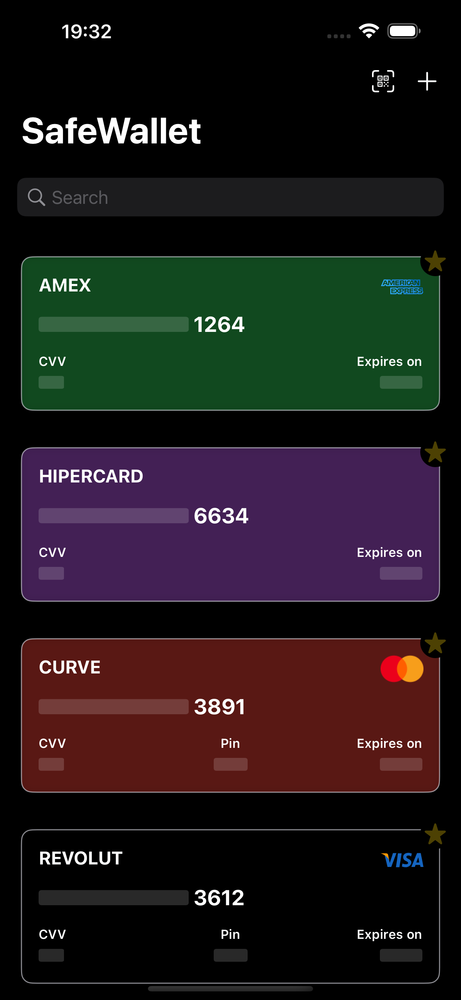
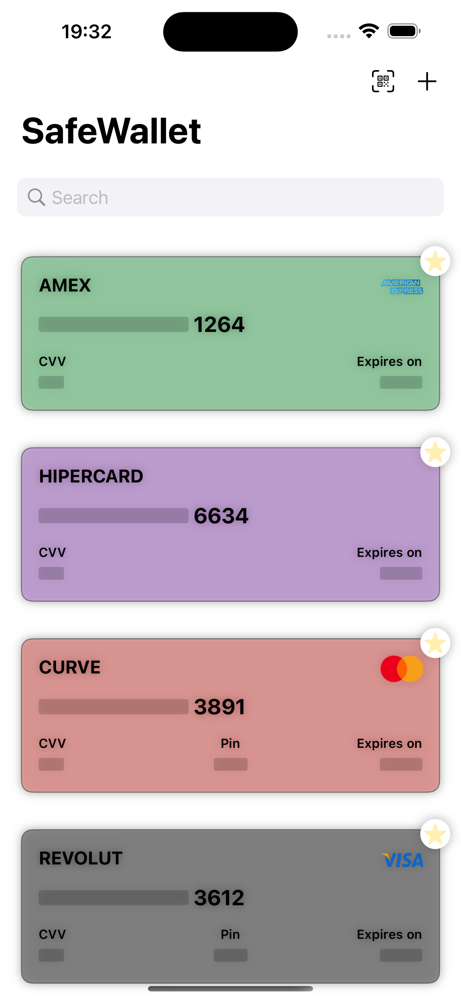
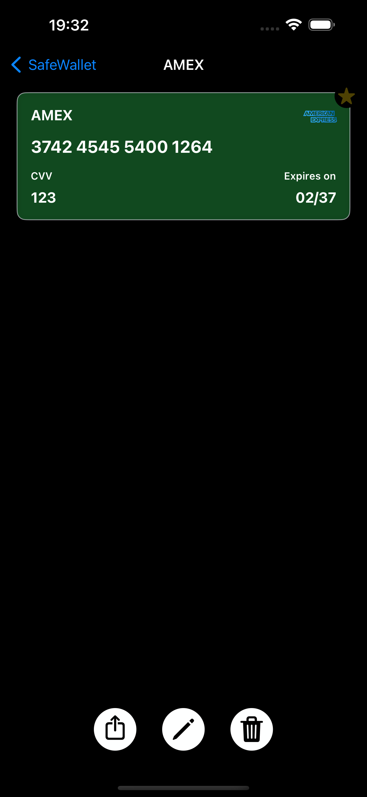
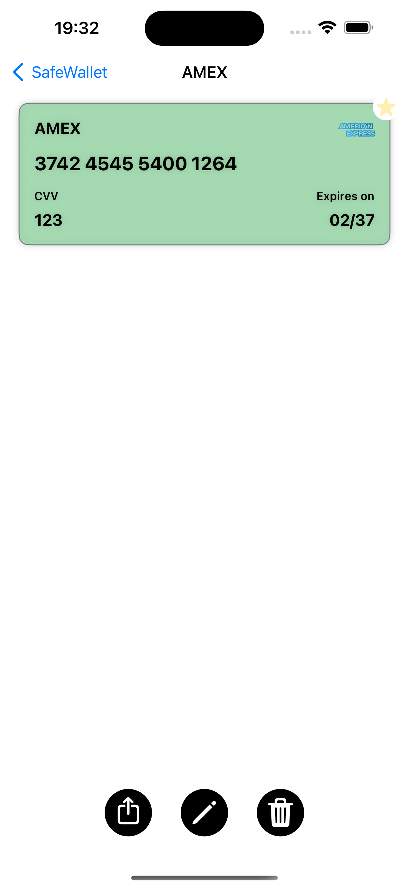
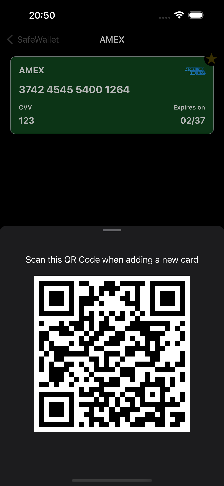
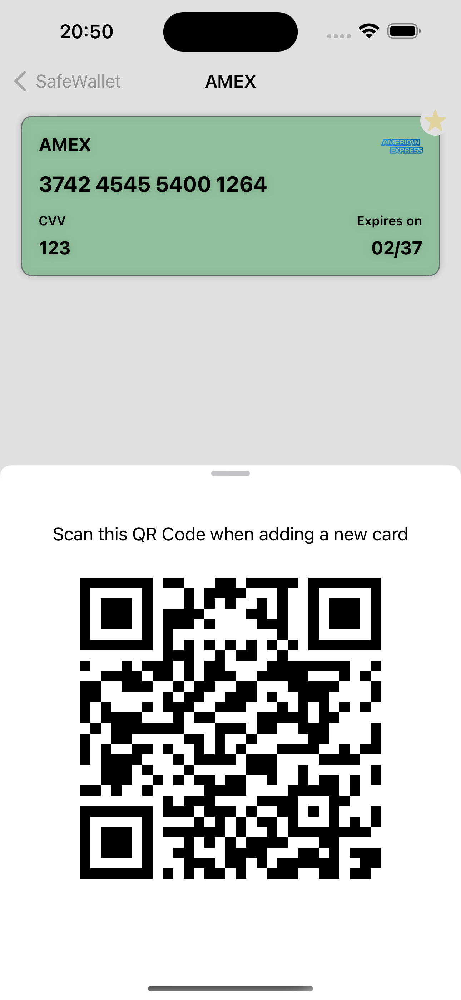

# SafeWallet

SafeWallet is a secure and user-friendly offline card management app that simplifies how I store, access, and share my card details. Developed using SwiftUI and CoreData, SafeWallet operates entirely offline, ensuring that all my information is securely kept on my device. It is designed for iPhone and iPad, supporting iOS 17.0 and above for an optimized experience.

### Features

- **Completely Offline**: Ensures all data is stored on-device for maximum security.
- **Card Management**: Add details such as card name, card number, expiry date, CVV, and card PIN.
- **QR Code Sharing**: Securely share card details through a QR code.
- **Quick Actions**: Tap on fields to copy or share information quickly.
- **Privacy Screen**: Display a privacy view when the app is in the background to mask sensitive information.
- **Auto-Dismiss**: Automatically dismiss sensitive information screens after 30 seconds of inactivity.
- **Edit Mode**: Easily edit card details whenever needed.
- **Color Differentiation**: Differentiate cards using multiple colors for easy identification.
- **Dark Mode Support**: Native dark mode support for ease of use in low-light environments.
- **Font Size Support**: Accommodate both small and large font sizes to enhance accessibility.

## Architecture

SafeWallet is built using the Model-View-ViewModel (MVVM) architecture to ensure the code is clean, maintainable, and scalable. This pattern enhances separation of concerns, allowing for more efficient development and testing.

## Screenshots

Take a look at SafeWallet in both light and dark modes:

### Card List

<p float="left">
  
  
</p>

### Card Details

<p float="left">
  
  
</p>

### QR Code Sharing

<p float="left">
  
  
</p>

## App Store

I am currently in the process of submitting the app to the App Store, soon there will be a testflight beta link and then a link to the app on the app store.

## Installation

To run SafeWallet on your device, clone the repository and open the project in Xcode:

```bash
git clone https://github.com/7Backwards/SafeWallet.git
