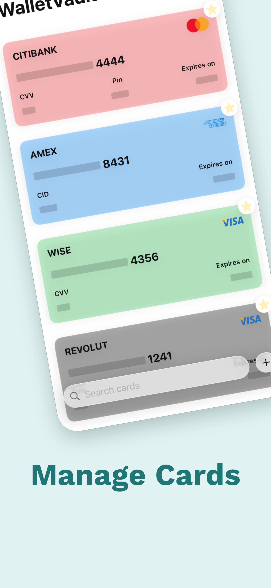
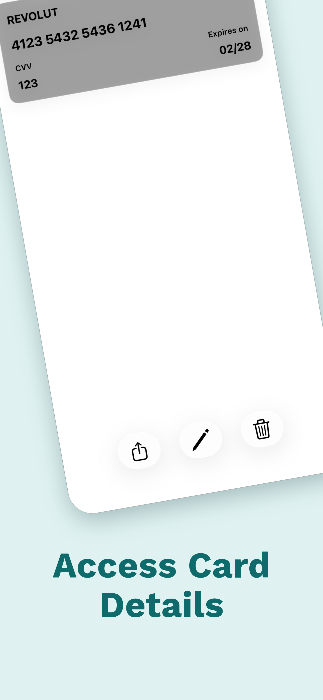
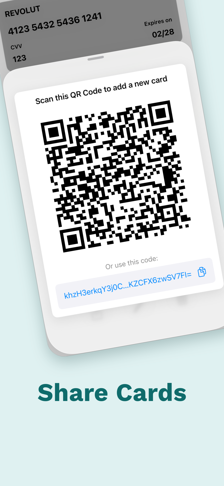

# WalletVault

WalletVault is a secure and user-friendly offline card management app that simplifies how I store, access, and share my card details. Developed using SwiftUI and CoreData, SafeWallet operates entirely offline, ensuring that all my information is securely kept on my device. It is designed for iPhone and iPad, supporting iOS 17.0 and above for an optimized experience.

### Features

- **Completely Offline**: Ensures all data is stored on-device for maximum security.
- **Card Management**: Add details such as card name, card number, expiry date, CVV, and card PIN.
- **Color Costumizability**: Costumize your cards with the color that you want.
- **QR Code Sharing**: Securely share card details through a QR code.
- **Quick Actions**: Tap on fields to copy or share information quickly.
- **Privacy Screen**: Display a privacy view when the app is in the background to mask sensitive information.
- **Auto-Dismiss**: Automatically dismiss sensitive information screens after 30 seconds of inactivity.
- **Edit Mode**: Easily edit card details whenever needed.
- **Color Differentiation**: Differentiate cards using multiple colors for easy identification.
- **Dark Mode Support**: Native dark mode support for ease of use in low-light environments.
- **Font Size Support**: Accommodate both small and large font sizes to enhance accessibility.

## Architecture

WalletVault is built using the Model-View-ViewModel (MVVM) architecture to ensure the code is clean, maintainable, and scalable. This pattern enhances separation of concerns, allowing for more efficient development and testing.

## Screenshots

### Card List

<p float="left">
  
</p>

### Add Card

<p float="left">
  
</p>

### Add New Colors

<p float="left">
  
</p>

## App Store

While I am currently unable to publish WalletVault on the App Store due to policy restrictions regarding individual accounts handling sensitive information, I remain committed to its development and improvement. You can still be a part of WalletVault's journey by joining the beta through TestFlight: https://testflight.apple.com/join/4wsV2Y7T
Let me know if you have some feedback!

## Installation

To run WalletVault on your device, clone the repository and open the project in Xcode:

```bash
git clone https://github.com/7Backwards/WalletVault.git
